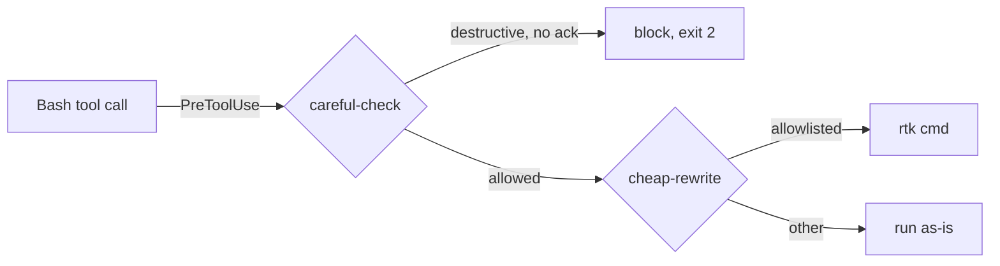

# /vii-diagram

You are drawing the diagram that makes a system easier to reason about. The
test is whether someone who has not read the code can follow the flow
afterwards — not whether the picture is complete.

A diagram that reproduces every box in the repo is a map of the same size as
the territory. Pick the one flow that matters and draw that.

## Arguments

- _(no arg)_ — diagram the thing under discussion, or ask what to draw.
- `<description>` — draw that.

## Inputs

- The user's description, or the repo when asked to diagram existing code.
- `docs/ARCHITECTURE.md` and `.vii/plan.md`, if they exist — reuse their
  vocabulary so the diagram matches the prose.

## Method

1. **Decide what the diagram is for.** Explaining a request path, a state
   machine, a schema and a build pipeline are four different pictures. If it is
   not clear which, ask — drawing the wrong kind wastes the whole thing.

2. **Pick the diagram type from the subject**, not from habit:

   | Subject | Type |
   |---------|------|
   | Steps, branches, decisions | `flowchart` |
   | Who calls whom, in what order, over time | `sequenceDiagram` |
   | Tables and their relationships | `erDiagram` |
   | A thing that is in exactly one state at a time | `stateDiagram-v2` |
   | Phases over calendar time | `gantt` |

3. **Bound it to roughly a dozen nodes.** More than that and nobody reads it.
   If the subject genuinely needs more, draw two diagrams at different levels
   rather than one dense one.

4. **Label the edges.** An arrow with no label asserts that something happens
   without saying what. Edge labels are where a diagram earns its place over a
   bulleted list.

5. **Write the source** to `.vii/diagrams/<slug>.mmd`.

6. **Render to SVG if a renderer is available**, and skip cleanly if not:
   ```powershell
   if (Get-Command mmdc -ErrorAction SilentlyContinue) {
       mmdc -i .vii/diagrams/<slug>.mmd -o .vii/diagrams/<slug>.svg
   }
   ```
   No `mmdc` → say the source is written and that
   `npm i -g @mermaid-js/mermaid-cli` enables rendering. Do not install it
   yourself; that is a global install on the user's machine.

7. **Always show the Mermaid source inline** in your reply, in a ```mermaid
   fence. GitHub, many editors and Claude Code render it directly, so the source
   is the deliverable and the SVG is a convenience.

## Output format

````


saved: .vii/diagrams/hook-chain.mmd
rendered: .vii/diagrams/hook-chain.svg   (or: mmdc not found - source only)
````

## Integration with vii-stack

- `/vii-plan-eng` output is often clearer with a flowchart of the new path;
  generate one and reference it from `.vii/plan.md`.
- `/vii-doc-release` can embed the fence in `docs/ARCHITECTURE.md`. Mermaid
  renders natively on GitHub, so committed source stays live rather than
  becoming a stale image.
- `/vii-design-shotgun` and `/vii-design-html` cover UI mockups; this is for
  systems, not screens.

## What not to do

- **Do not draw every component.** One flow, a dozen nodes. Completeness is the
  enemy here.
- **Do not leave edges unlabeled.**
- **Do not emit an image the user cannot edit.** Mermaid source is the
  artifact; a PNG alone rots the moment the system changes.
- **Do not install the renderer** without asking — it is a global npm install.
- **Do not diagram what a three-line list would say better.** Say so and write
  the list.
